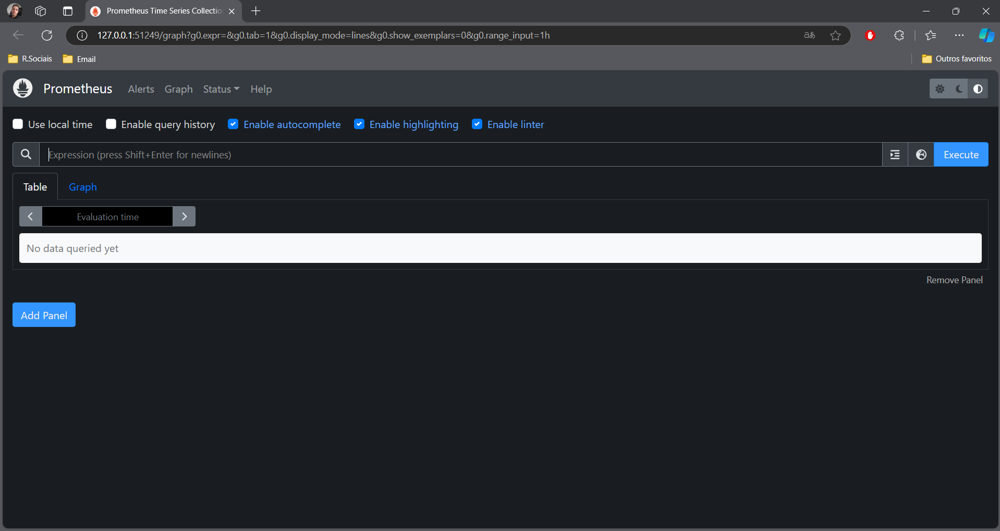
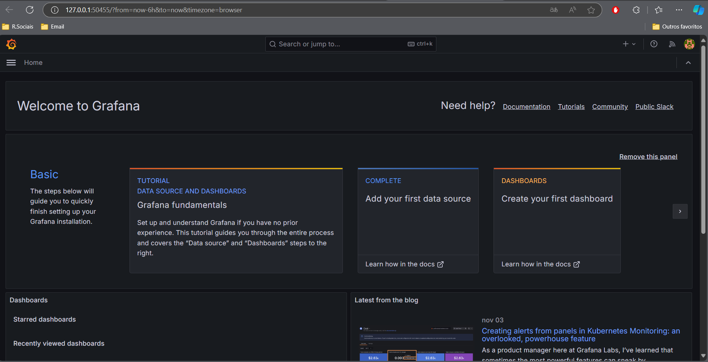
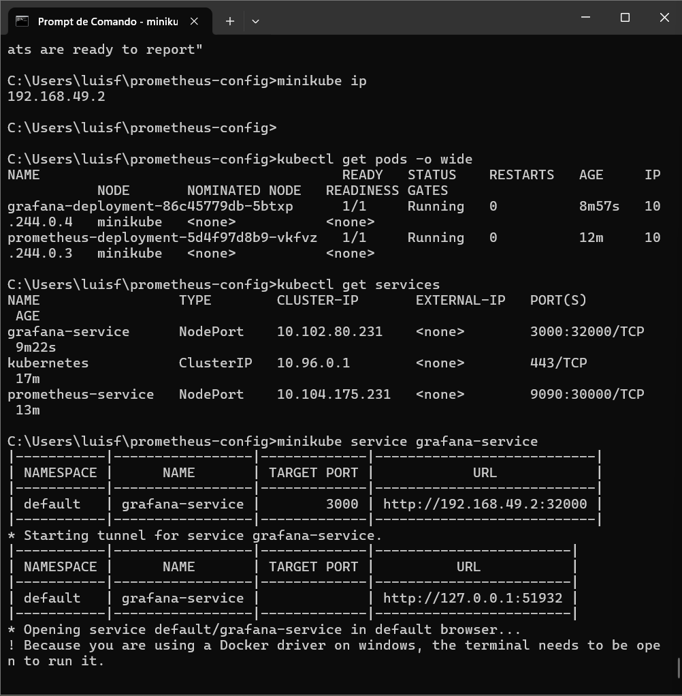

# Projeto de Monitoramento com Prometheus e Grafana

## Descrição

Este projeto tem como objetivo implementar uma solução de monitoramento para um cluster Kubernetes utilizando Prometheus para coleta de métricas e Grafana para visualização. O projeto foi desenvolvido em um ambiente local utilizando o Minikube.

## Tecnologias Utilizadas

- **Kubernetes**: Orquestração de contêineres.
- **Minikube**: Ferramenta para executar Kubernetes localmente.
- **Prometheus**: Sistema de monitoramento e alerta.
- **Grafana**: Plataforma de visualização de dados e métricas.

## Objetivos do Projeto

- Configurar o Prometheus para coletar métricas de serviços em execução no cluster Kubernetes.
- Implementar o Grafana para visualizar essas métricas.
- Criar dashboards para monitoramento em tempo real (com foco na implementação, embora não tenha sido possível configurar um dashboard completo neste momento).

## Estrutura do Projeto

1. **Configuração do Minikube**: O cluster Kubernetes foi configurado utilizando o Minikube.
2. **Implementação do Prometheus**: O Prometheus foi instalado e configurado para descobrir serviços no cluster Kubernetes.
3. **Implementação do Grafana**: O Grafana foi instalado e configurado para se conectar ao Prometheus como fonte de dados.

## Status do Projeto

- O Prometheus está funcionando corretamente e coletando métricas.
- O Grafana foi configurado, mas não foi possível criar e visualizar gráficos no dashboard devido a problemas na conexão com as métricas.

## Desafios Enfrentados

- Dificuldades em conectar o Grafana ao Prometheus e em configurar dashboards com gráficos visíveis.
- Erros de "no data" ao tentar visualizar métricas no Grafana.

## Conclusão

Embora o objetivo de criar dashboards completos no Grafana não tenha sido alcançado, o projeto demonstrou que a coleta de métricas está funcionando corretamente com o Prometheus. O aprendizado e as experiências adquiridas durante o desenvolvimento serão valiosos para futuros projetos de monitoramento.

## Próximos Passos

- Investigar e resolver problemas de configuração do Grafana para visualização de métricas.
- Considerar a adição de mais métricas e serviços para um monitoramento mais abrangente.

---

Sinta-se à vontade para adicionar informações adicionais ou personalizar conforme necessário. Se precisar de mais alguma coisa, é só avisar!

## Imagens do projeto

1. Prometheus

2. Grafana

3. Aplicações

